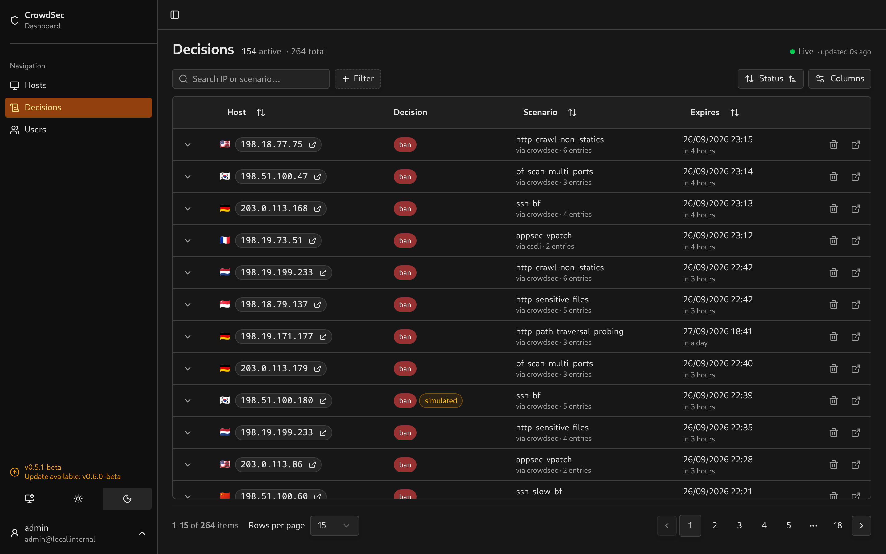

# Getting started

CrowdSec Local Dashboard displays decisions from your CrowdSec Local API (LAPI), keeps a local history in SQLite and lets you remove decisions from the browser.



## 1. Download the Compose files

You need Docker with the Compose plugin and a running CrowdSec instance. On the host where you want to run the dashboard:

```sh
mkdir crowdsec-local-dashboard
cd crowdsec-local-dashboard
curl -fLO https://raw.githubusercontent.com/ollioddi/crowdsec-local-dashboard/main/docker-compose.yml
curl -fL -o .env https://raw.githubusercontent.com/ollioddi/crowdsec-local-dashboard/main/.env.example
```

Keep `docker-compose.yml` and `.env` in this directory. The Compose file selects a tagged dashboard image; you do not need to clone or build the repository.

## 2. Connect to CrowdSec

Edit these four values in `.env`:

```env
LAPI_URL=http://192.168.1.100:8080
LAPI_MACHINE_ID=your-machine-login
LAPI_MACHINE_PASSWORD=your-machine-password
LAPI_BOUNCER_API_TOKEN=your-bouncer-token
```

Use your actual LAPI address and credentials:

- **LAPI URL:** an address reachable from the dashboard container, including the port. `localhost` inside the container refers to that container, not your CrowdSec host.
- **Machine ID and password:** copy `login` and `password` from `/etc/crowdsec/local_api_credentials.yaml` on your CrowdSec host. These let the dashboard fetch alert evidence.
- **Bouncer token:** run `cscli bouncers add crowdsec-local-dashboard` on the CrowdSec host and copy the token it prints. This lets the dashboard read decisions.

[LAPI setup](lapi-setup.md) explains the credentials and network requirements. Leave `BETTER_AUTH_SECRET` empty for Docker: the container generates and stores one in its data volume. If you will serve the dashboard over HTTPS, also set `BETTER_AUTH_URL` to its public URL.

The remaining settings can stay at their defaults. See [Configuration](configuration.md) for the full reference.

## 3. Start the dashboard

```sh
docker compose up -d
```

Open `http://<dashboard-host>:3000`, or `http://localhost:3000` if it is running on your computer. Create the first account when prompted.

The first sync starts automatically. If it fails, check the sync banner and the container logs:

```sh
docker compose logs --tail=100 dashboard
```

The dashboard can start without CrowdSec credentials, but decisions will not appear until the LAPI settings are filled in. After changing `.env`, run `docker compose up -d` again.

## Next steps

- [Using the dashboard](using-the-dashboard.md): filters, alert evidence, connection status and decision removal.
- [Integrations](integrations.md): the evidence available for Traefik, AppSec, OPNsense and SSH.
- [Deployment](deployment.md): updates, persistent storage and reverse proxies.
- [SSO / OIDC](sso.md): optional single sign-on.
- [Troubleshooting](troubleshooting.md): login problems, missing evidence and sync failures.

## Contributing

- [Development setup](CONTRIBUTING.md): running the app, docs and screenshot tooling locally.
- [Contributing a parser](contributing-a-parser.md): adding fields or supporting another log source.
- [Releasing](releasing.md): commit conventions and release workflows.
