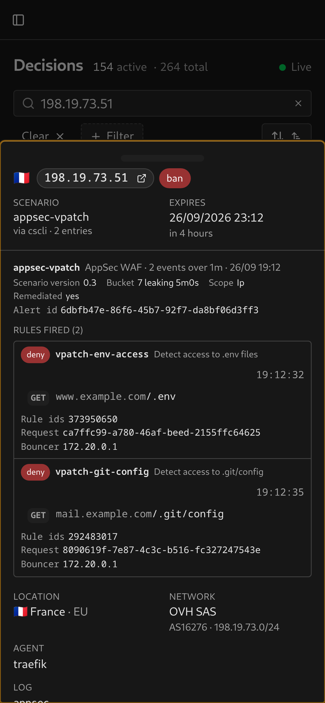

# AppSec WAF

Log type `appsec-block`, plus the in-band rule events the AppSec datasource emits without any log type. Both appear in the rule list.

## Evidence

Each rule match shows the rule name, description and time. When interruption status is available, a badge shows the action for a blocked request or `detected` for a match that did not interrupt it. Request details include the host and path, matched zones, captured payload, rule IDs, request UUID and bouncer address when available.

<table>
  <tr>
    <td></td>
    <td></td>
  </tr>
</table>

## Setup

Configure the [CrowdSec AppSec component](https://docs.crowdsec.net/docs/appsec/intro) and the dashboard’s [watcher credentials](../lapi-setup.md#watcher-credentials-machine-id--password). No additional dashboard setting is required. AppSec events can report `appsec` as their log source instead of a file path.
