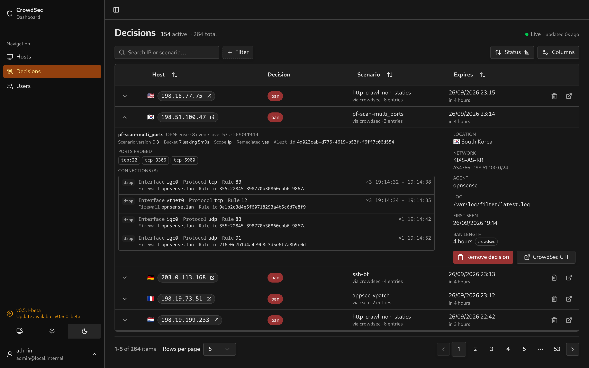
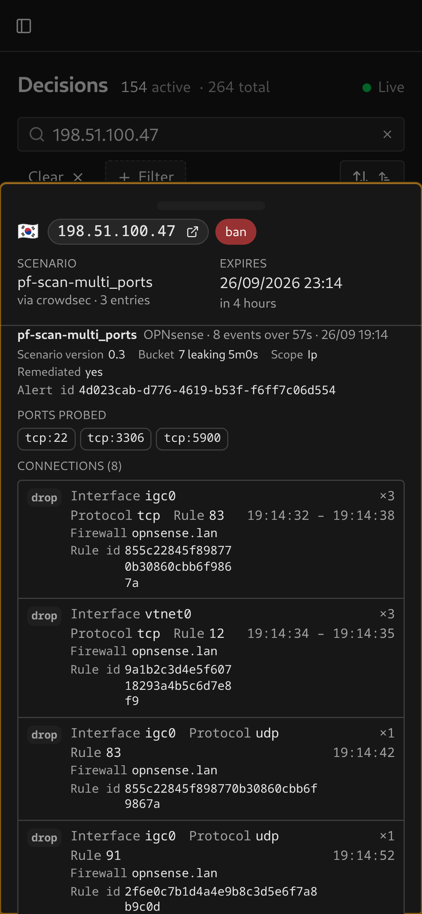

# OPNsense

Log types `pf_drop` and `pf_pass`, from the `os-crowdsec` plugin's `firewallservices/*` scenarios.

## Evidence

Destination ports appear as chips. Connections are grouped by action, interface, protocol, rule and firewall host. Each group shows its retained event count and time span, with the hostname and full rule ID below it.

<table>
  <tr>
    <td></td>
    <td></td>
  </tr>
</table>

The current integration reads ports from the alert’s `dst_port` metadata. The captured pf event fixtures do not contain individual destination ports.

## Setup

Once the OPNsense CrowdSec plugin is sending alerts, no additional dashboard setting is required. Set `LAPI_URL` to OPNsense if it hosts LAPI, or to the separate LAPI host otherwise.
