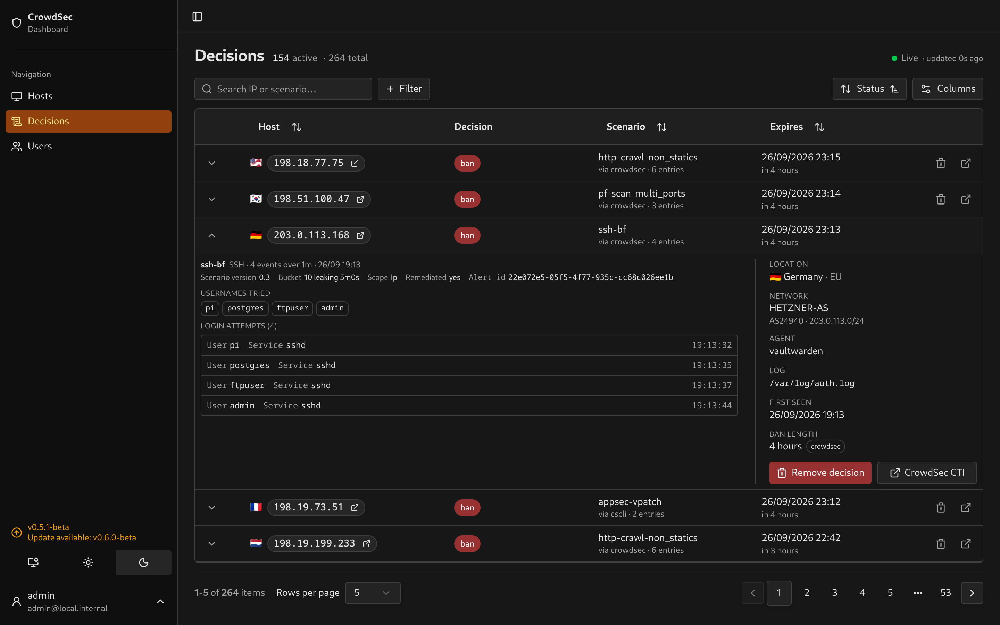

# SSH

Reads SSH event types such as `ssh_failed-auth`, with usernames from `target_user`. These fields come from [CrowdSec’s sshd parser](https://github.com/crowdsecurity/hub/blob/master/parsers/s01-parse/crowdsecurity/sshd-logs.yaml). The integration also accepts older `ssh_user` metadata.

## Evidence

Usernames appear as chips, followed by each retained attempt’s username, service and time.

<table>
  <tr>
    <td></td>
    <td></td>
  </tr>
</table>

The username list combines alert aggregates with retained events. It can contain more names than the attempt list when CrowdSec has kept only part of the event history.

## Setup

Configure CrowdSec to collect sshd logs and give the dashboard [watcher credentials](../lapi-setup.md). Tests use upstream field definitions; a captured SSH alert is still needed to validate the complete integration. If you can provide one, [open an issue with a sample alert](../integrations.md#adding-your-stack).
