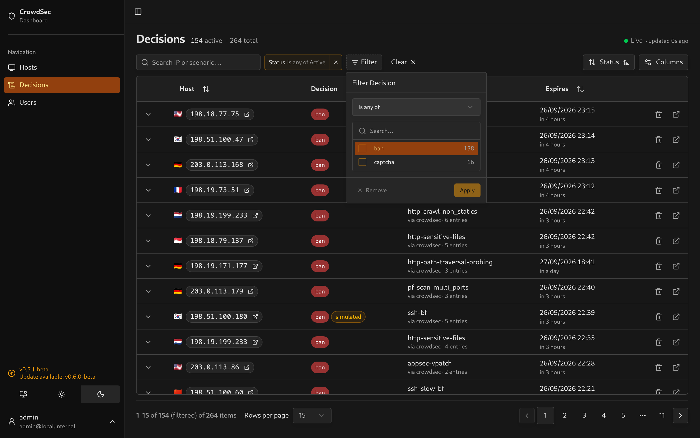
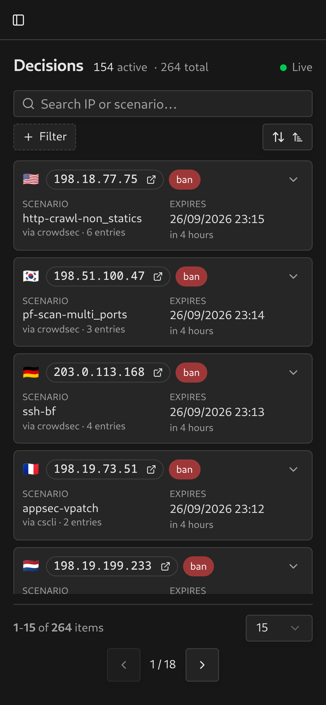
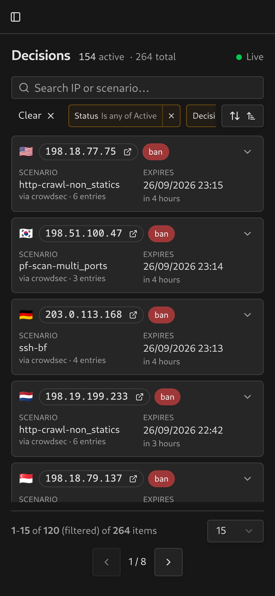
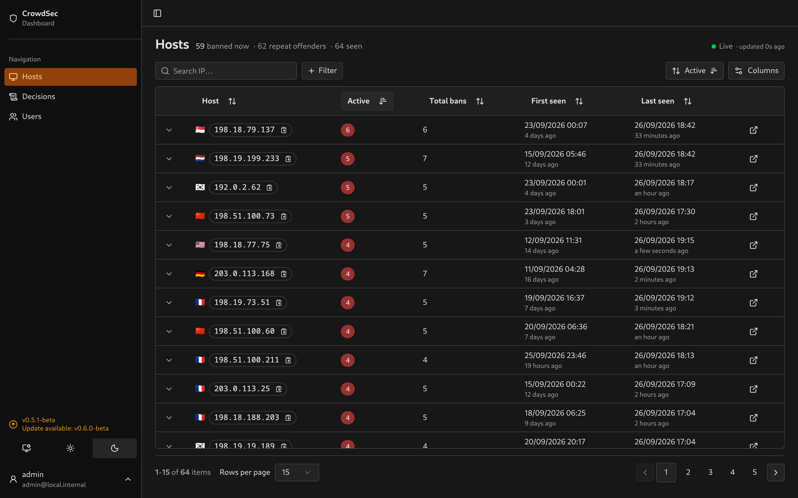

# Using the dashboard

Browse decisions, inspect the alerts behind them and remove decisions from CrowdSec.

## Saving a view

The URL stores pagination, sorting, filters, search, expanded rows and visible columns. Bookmark or share it to return to the same view.

The decisions table shows five columns by default. Status, origin, country and created date are still there for filtering and sorting, just hidden. Turn them on from the Columns menu.

Use the Filter button to add filters. Each filter appears as a chip that you can edit or remove.

## Connection and sync status

The **Live** indicator shows the browser’s connection to the dashboard server. The sync banner separately reports the server’s connection to CrowdSec.

When a poll fails, a banner at the top of every page shows the error and the time of the last successful sync, and clears itself on the next good poll. If `LAPI_URL` or the bouncer token are missing, the banner says that instead of showing a connection error.

Missing watcher credentials have their own warning. Decisions can sync with a bouncer token alone, but fetching alert evidence requires watcher credentials.

## Reading a decision

**Click anywhere on a row** to expand it. Clicks on a link or a button inside the row still do their own thing.

**Ban length** is calculated from the linked alert’s creation time to the decision’s expiry. LAPI reports the remaining duration, so the dashboard cannot use it as the original ban length. Without a linked alert, the length is shown as Unknown.

**`overdue`** means the decision is still marked active but its expiry has passed.

**Simulated decisions** are marked with a badge. They record what CrowdSec would have decided in simulation mode.

**Scope** distinguishes a Range ban from a single IP ban.

**Origin** says who decided: `crowdsec` for your own agents, `cscli` for manual bans, and `CAPI`, `lists` or `console` when included in [`LAPI_DECISION_ORIGINS`](configuration.md#crowdsec-lapi).

Relative times tick live. Country codes are spelled out next to the flag.

## The alert evidence

Expanded decisions show evidence on the left and host details on the right. On mobile, these sections appear in a drawer. Each linked alert includes:

- **Header**: scenario, source, event count, time window, scenario version, bucket settings, scope, remediation status and alert ID. For a leaky bucket, `10 leaking 10s` means capacity 10 with one event leaking out every ten seconds. See [CrowdSec’s scenario settings](https://docs.crowdsec.net/docs/log_processor/scenarios/format/) for the overflow rules.
- **Client tags**: CVE, technology and JA4H values when present in the alert metadata.
- **Evidence**: HTTP requests, AppSec rule matches, firewall connections or SSH attempts. An alert containing several sources shows each source separately. [Integrations](integrations.md) describes the available fields.
- **Other fields**: parsed values without a dedicated display, including aggregate values absent from the retained events.
- **Not parsed**: nonblank metadata keys the parsers did not read.

The details column lists location, network, reporting agent, log source, first-seen time and ban length. Remove decision and CrowdSec CTI buttons appear below it.

## On a phone

On a phone, decisions appear as cards. Tap a card header to open its details in a drawer. Filters scroll horizontally in one row, with Clear placed first.

<table>
  <tr>
    <td></td>
    <td></td>
    <td></td>
  </tr>
</table>

The detail API reparses stored events when evidence is fetched. Parser updates can improve older evidence, but cannot recover metadata that was never stored.

## Deleting a decision

Remove decision asks for confirmation, then deletes that decision from CrowdSec. Other active decisions for the host can still block it.

If CrowdSec has already removed it, the dashboard marks the local decision inactive.

## Hosts

A host with no active decisions but bans on record links through to its expired decisions rather than an empty list.

ASN details come from alerts and require watcher credentials. Country information can also come from the dashboard’s local GeoIP lookup.

## Retention

Expired decisions remain in the local database after CrowdSec removes them. [`DECISION_RETENTION_COUNT` and `DECISION_RETENTION_DAYS`](configuration.md#retention) decide how much is kept. Age is applied first, then the count.

## When the connection drops

The browser keeps loaded data in memory while the app is open. Offline behaviour depends on what has already loaded:

- **Browser offline**: an Offline banner appears and loaded data stays visible. Requests for missing data pause until the connection returns. Navigation also needs the page’s code to have finished preloading.
- **Server unreachable**: a failed page load shows a retry button. The live connection indicator turns red after an error or roughly 45–50 seconds without a heartbeat, and the event stream reconnects automatically.
- **Reloaded while offline**: an active service worker shows the “No connection” page, which reloads when the browser reports that it is online. The worker must have registered during an earlier visit over HTTPS or localhost. Authentication routes are excluded from this fallback.

## Installing it as an app

It installs to a phone home screen or a desktop, starting on the decisions list, with long-press shortcuts to Decisions and Hosts.

> [!NOTE]
> Installing needs a secure context. Over plain HTTP at an IP, which is the default setup, you get the theming but no install prompt and no offline page. Serve it over HTTPS to install it.

The service worker caches static assets and the offline fallback page. It does not persist authenticated pages or API responses. Loaded data in the app’s memory is lost when the page closes or reloads.

## Version and updates

The sidebar footer shows the version the build was made from. Unless `UPDATE_CHECK=false`, the server asks GitHub for the newest release a few times a day and the badge reads **Update available** when there is one. Local and untagged builds show `dev` and are never flagged.
